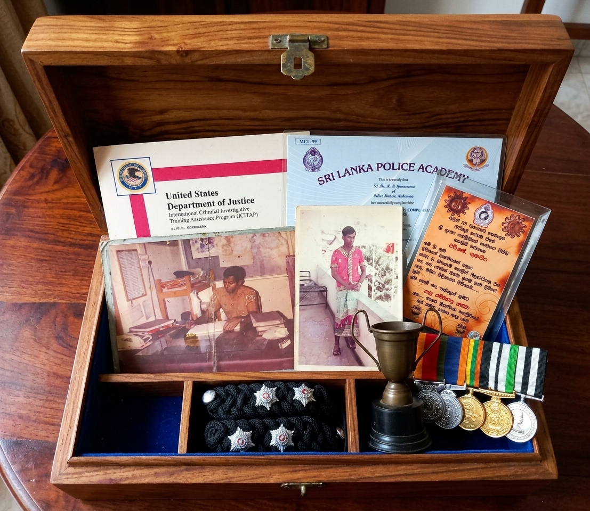
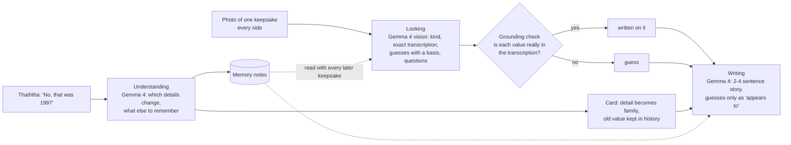
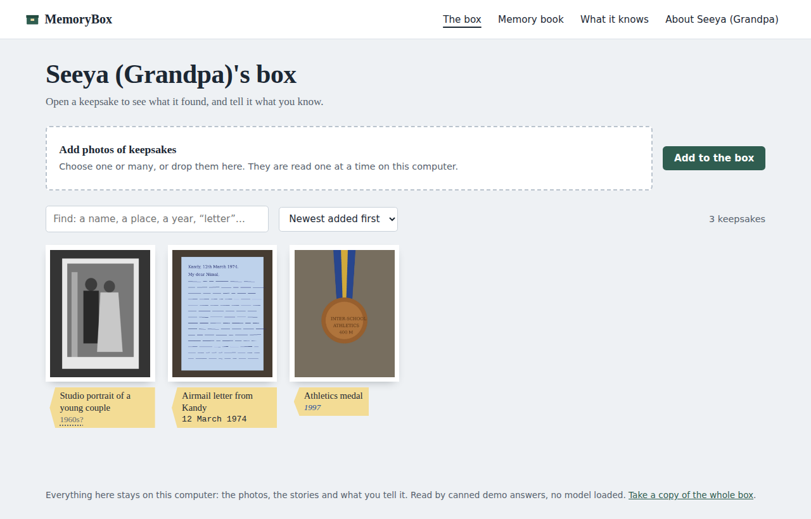
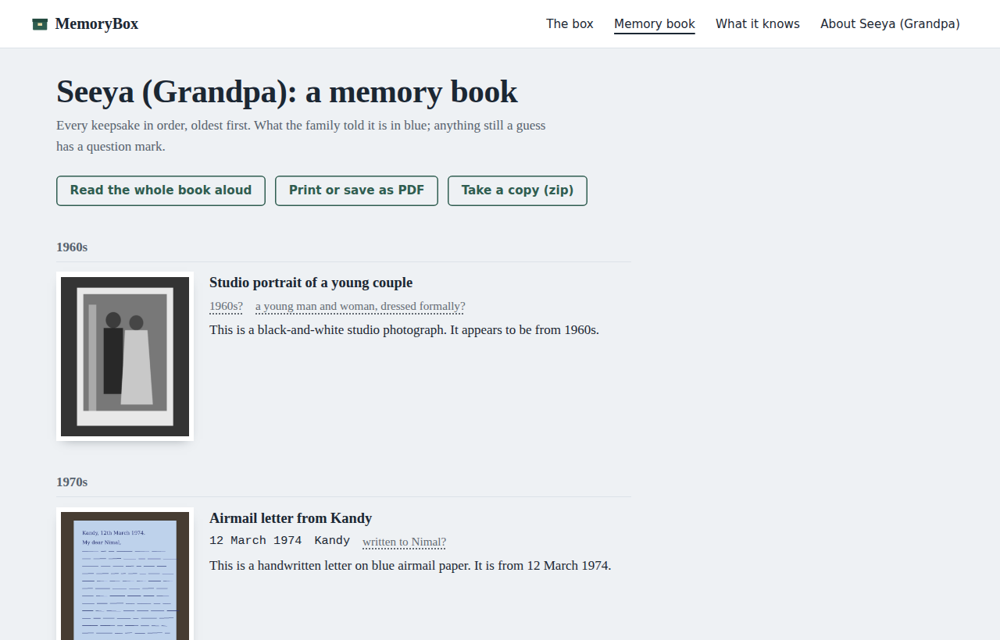
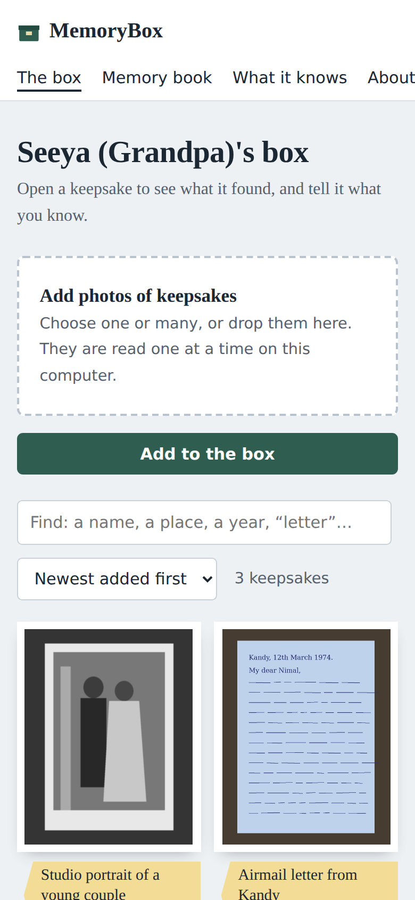

# Thaththa's Memory Box

**Your personal AI agent for family memories, running at home on Gemma 4.**

> Built for my father, with love.
[](https://youtu.be/TQnalzTmMiE)

▶ **Demo video:** https://youtu.be/TQnalzTmMiE



Thaththa has a box of things he has kept for about 30 years: certificates, awards, medals, newspaper articles,
old photographs and coins. Only he knows the stories behind them.

Thaththa's Memory Box is a personal AI agent that runs on a laptop at home. Photograph a keepsake, and the agent:

1. **reads it** with Gemma 4: what it is, every word written on it, and careful guesses about when, where, who and why;
2. **asks** the family the questions that would fill the biggest gaps;
3. **remembers** what they answer, and reads every later keepsake knowing it.

Nothing leaves the house: no account, no API key, no cloud. The whole archive is one folder you can copy to a USB stick.

## The rule it is built on: it never invents a memory

Every detail on a card carries where it came from, shown in three inks:

| Ink | Source | How it gets there |
|---|---|---|
| *Blue italic* | **the family** | Someone told it. Nothing the model does later can overwrite it. |
| `Typewriter` | **written on the object** | The model says it read it **and** the code finds that value in the model's transcription of the object. "1998" only counts as read if "1998" is in the transcribed text. |
| Grey, with a `?` | **a guess** | Everything else. The story may only use it with "appears to", and the card asks the family about it. |

For example: if a medal has no date on it and Gemma guesses 1998, the card shows **1990?** in grey and asks
*"What year was this race?"*. When Thaththa answers *"No, that was 1998"*, the card shows **1998, from Thaththa**,
the old guess moves into the card's history, and a memory note is saved for every later keepsake.

The model proposes; plain Python decides what counts as known (`src/memorybox/memory.py`). That is the difference
between a memory collection and a confident fiction about someone's life.

## How it works



- **Looking** sends every photo of the keepsake (front and back, or each page of a letter) together with what the
  family has said so far.
- **Understanding** turns free text into field updates. If the model cannot place the words, they are still kept on
  the card exactly as said. Nothing a person typed is ever thrown away. Details can also be edited directly, with no model.
- **One background worker** reads the box one photo at a time, so twenty photos can be added at once while the
  family keeps browsing. After a restart, unfinished items are picked up again.

### Making a small local model reliable

- **Ollama's native API with a JSON Schema in `format`**, so decoding is constrained and every reply parses.
- **Thinking off (`think: false`)**: faster on a laptop, and the model never runs out of output budget mid-answer.
- **`num_ctx` set explicitly**, so long family notes never silently push the instructions out of the context window.
  Only the notes that share words with the keepsake being read are sent.

## Run it

### 1. Install Ollama and Gemma 4

Download Ollama from https://ollama.com/download, then:

```bash
ollama pull gemma4:e4b          # ~4 GB, the default
ollama pull gemma4:e2b          # optional fallback, used if the bigger one runs out of memory
```

| Your computer | Use |
|---|---|
| 8 GB RAM, no graphics card | `gemma4:e2b` |
| 16 GB RAM (most laptops) | `gemma4:e4b` (default) |
| 24 GB+ Mac or a good GPU | `gemma4:26b`, which reads faded handwriting better |

To change model, edit the `primary` lines in `config/models.toml`.

### 2. Install and start the app

You need Python 3.12 or newer.

**Windows**
```bat
git clone https://github.com/JayanaGunaweera01/memory-box-agent.git
cd memory-box-agent
python -m venv .venv
.venv\Scripts\activate
python -m pip install -e . pytest
memorybox
```

**macOS / Linux**
```bash
git clone https://github.com/JayanaGunaweera01/memory-box-agent.git
cd memory-box-agent
python3 -m venv .venv
source .venv/bin/activate
python -m pip install -e . pytest
memorybox
```

Or, with [uv](https://docs.astral.sh/uv/): `uv sync` then `uv run memorybox`.

Open **http://localhost:8000**. The terminal also prints a link for a phone on the same Wi-Fi.
The first photo takes longest while Gemma loads into memory.

### Options

| Command | What it does |
|---|---|
| `memorybox --demo` | Canned answers and no model, to try the app on any machine. Demo mode does not look at your photos. |
| `memorybox --new-box` | Puts the current box away in an archive folder and starts empty. |
| `memorybox --host 127.0.0.1` | Only this computer can open it. |
| `MEMORYBOX_OLLAMA_TIMEOUT_S=1200` | Give a slow laptop more time per photo. |
| `OLLAMA_HOST=192.168.1.50:11434` | Use Gemma on another computer in the house. |

### Where the archive lives

`~/.memorybox` (on Windows `C:\Users\<you>\.memorybox`), or `MEMORYBOX_HOME`:

- `memories.json`: every keepsake, every detail with its source, every correction and memory note. Readable in a text editor.
- `photos/`: the photos, with location data (GPS) and other metadata removed.

Copy the folder to keep it; delete it to forget everything.

## Pages

| | |
|---|---|
|  |  |

- **The box**: every keepsake with a manila tag. Add photos (many at once, or drag them in), search by name,
  place or year, and sort by date. While it reads, it shows how many are left and roughly how long.
- **A keepsake**: the photo (click to enlarge), its catalogue card, the story (read aloud on the device), the
  questions the agent is wondering about, *Tell it what you know*, and the history of what changed and who said so.
  **Add the back or another page** reads every side together, because the date is so often written on the back.
- **Memory book**: everything by decade, oldest first, with a cover page when printed or saved as PDF, or read aloud.
- **What it knows**: every memory note, who said it and when, each with a remove button.
- **Take a copy**: the whole box as one zip, including `memory-book.html`, which opens in any browser with no app
  and no internet.
- **Start a new box** (on the About page): puts the current box away in an archive folder and starts empty.

It works on a phone too:



## Why open models

- **Privacy**: a father's certificates, letters and photographs should not be uploaded to a provider to be
  described. Here the model is a file on the family's computer, and it works with the Wi-Fi off.
- **It lasts**: no subscription, key or service that can change its terms or shut down. The archive and the model
  both keep working in ten years.
- **Control**: the never-invent rule is enforced in code around the model, and the model can be swapped by editing
  one line.
- **Cost**: nothing per photo, so the whole box gets catalogued, not just the ten best things.

## Project layout

```
config/models.toml        which Gemma model does which job
prompts/                  look, write and understand prompts
src/memorybox/
  memory.py               provenance rules: sources, grounding check, corrections
  pipeline.py             the three model jobs and the background worker
  store.py                the local archive (memories.json + photos)
  photos.py               resizing and metadata stripping
  adapters/ollama.py      Gemma 4 through Ollama's native API
  router.py, config.py    model per stage, with a fallback
  web/                    the pages (FastAPI, Jinja, htmx)
  launch.py               the `memorybox` command
tests/                    28 tests
```

## Tests

```bash
pytest
```

28 tests: the provenance rules, the Ollama adapter, and the whole app over HTTP with a stand-in model.

## License and credits

Apache License 2.0, see `LICENSE`. Third-party credits (Gemma 4, Ollama, htmx and the Python libraries) are in
`NOTICE.md`.
